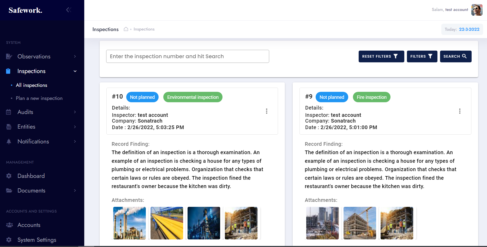
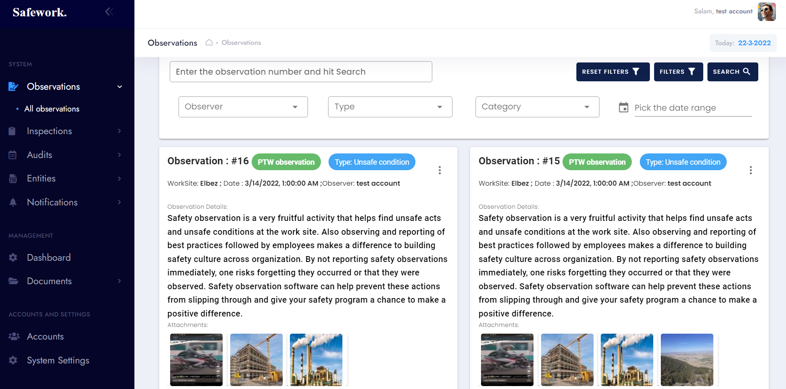
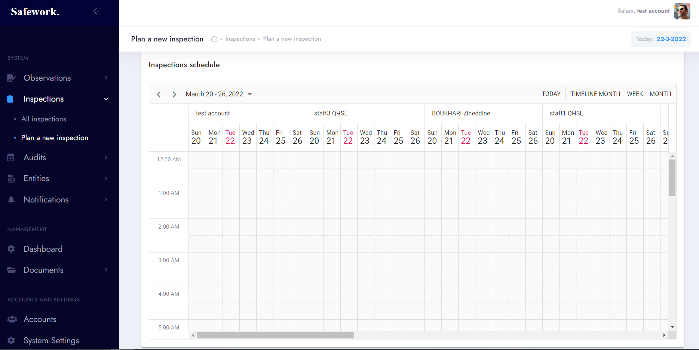
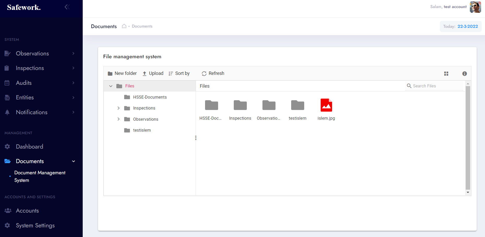
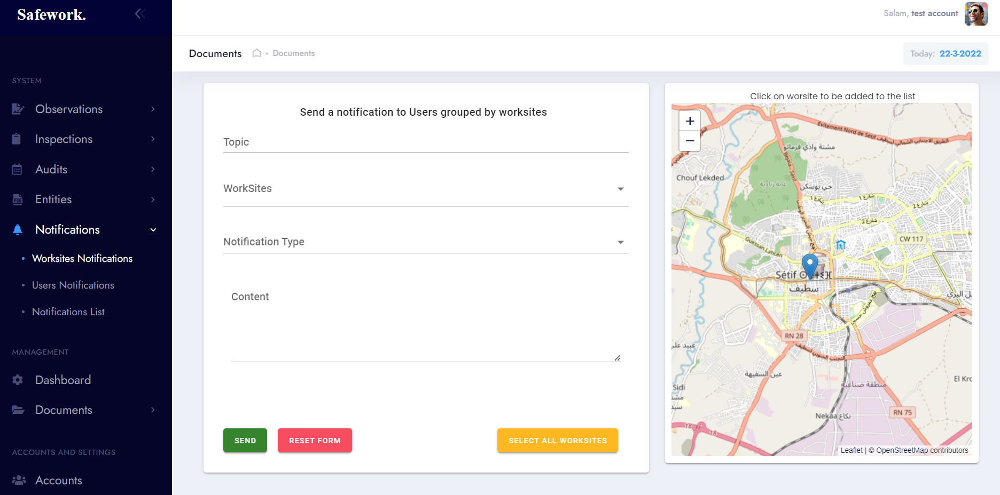
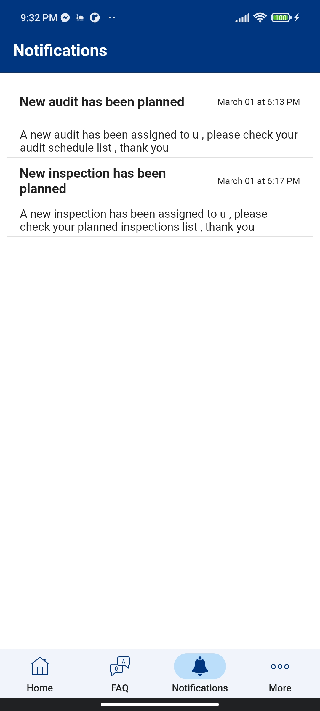

# Safework
Environment Health and Safety management system
# Description
This project is intended to make optimal use of technology by reducing and eliminating manual processes, introducing new HSSE services via mobile application, thus improving the client's operating efficiency and effectiveness, and will also improve communication between Departments in relation to HSSE aspects, improvement of Safety Culture and strive towards achieving Operational Excellent.
# Objective
The objective of the project is to provide business process automation, information delivery and collaboration for the client at a touch of a fingertip using smart phone application by both client’s staff and Contractors. This will enhance current HSSE Processes, user-friendly tools will allow addressing HSE related issues, conducting safety observations, review current live activities, and monitor performance dashboard through mobile phones. The Project will enhance existing e-services, and will incorporate new developments as well.
# Demo
## Web portal

## Mobile app

